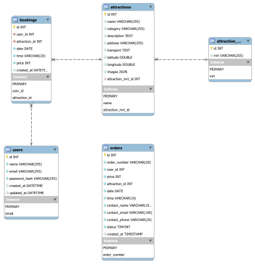
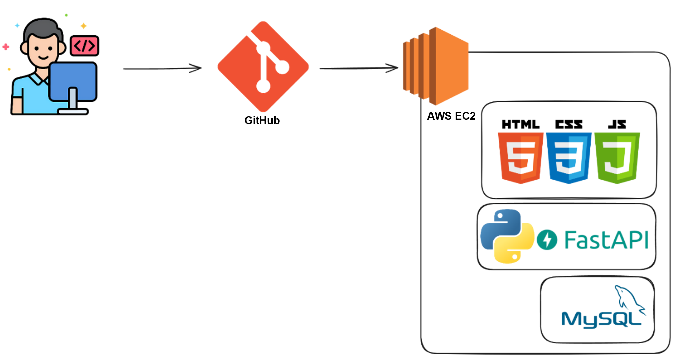

# [Taipei Day Trip](https://taipei-day-trip.online/) 
#### Taipei Day Trip is a travel e-commerce website that provides a guided experience of attractions in Taipei. Users can explore attractions, book tours, and place orders online.

## Introduction
This project simulates a travel platform where users can:

- View and search for popular attractions in Taipei
- Book a half-day tour with a preferred time slot
- Register and log in as members
- Place an order and complete payment flow

## Technical Skills
### Frontend

- HTML, CSS, JavaScript
- Responsive design with Flexbox
- RESTful API integration with Fetch

### Backend

- Python + FastAPI
- RESTful API design
- JWT for user authentication
- Bcrypt for password hashing

### Database

- MySQL
- SQLAlchemy (ORM)
- ERD designed with dbdiagram.io

### Deployment

- AWS EC2 (Ubuntu Server)
- Nginx as reverse proxy
- Git for version control
## Entity Relationship Diagram (ERD)

### The system contains the following main entities:

- `users`: stores user credentials and info
- `attractions`: contains attraction data (name, location, category, etc.)
- `bookings`: stores booking data by users
- `orders`: stores completed order and contact info
- `attraction_mrt`: links MRT station names to attractions
## Deployment Flow 

1. Developers push code to GitHub
2. EC2 server pulls code
3. Backend starts FastAPI server
4. Frontend served via Nginx (or static)
5. MySQL handles data operations

## Demo
### Infinite Scroll
Load new attraction pages as the user scrolls with the mouse.

### Search by Keyword
Use the search bar and the scrollable list in the center to browse attractions.

## Contact
- Author: Conan Chang (張兆丞)
- Email: changchaocheng870405@gmail.com
- GitHub: [Translation-regulator](https://github.com/Translation-regulator)